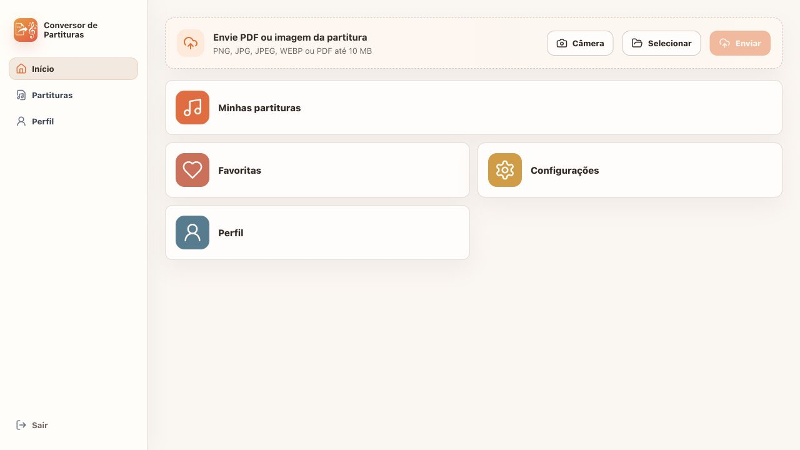
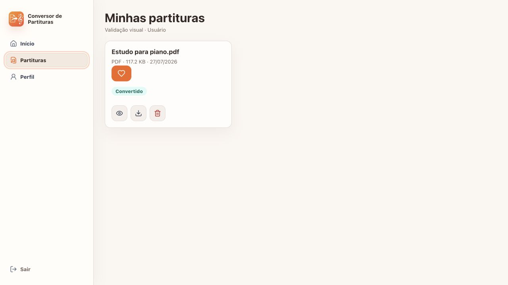
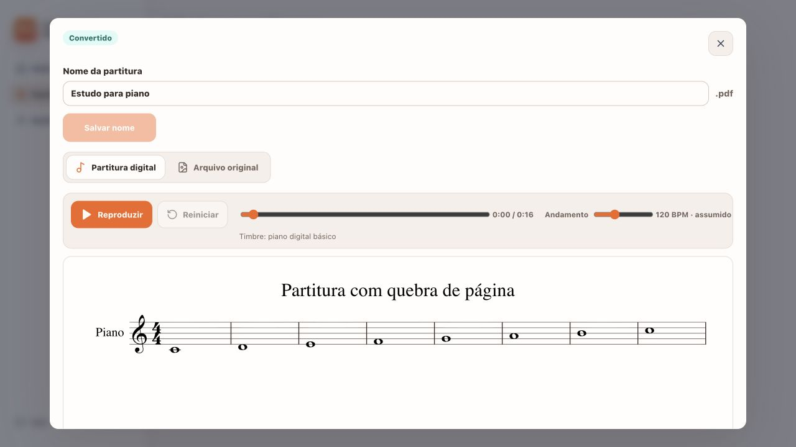
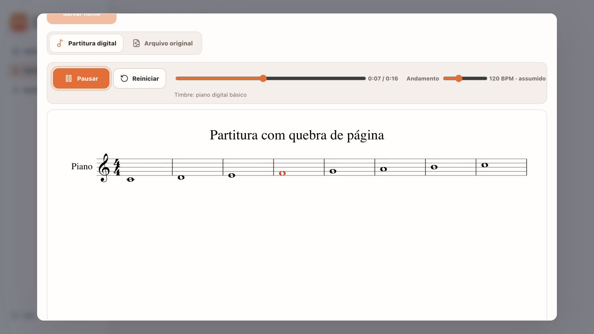
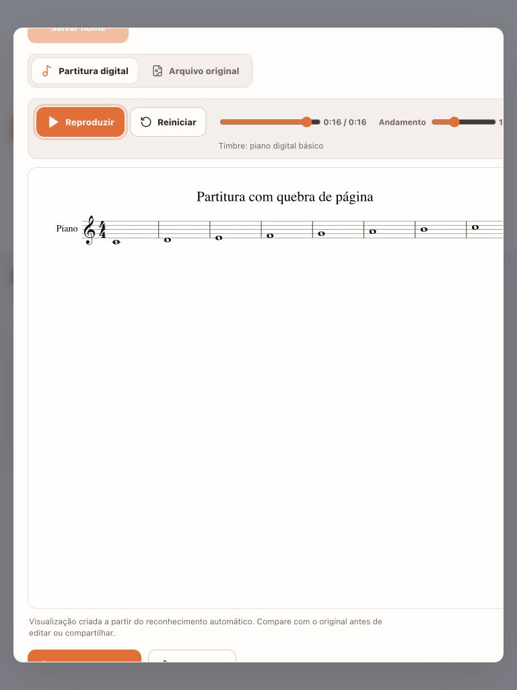
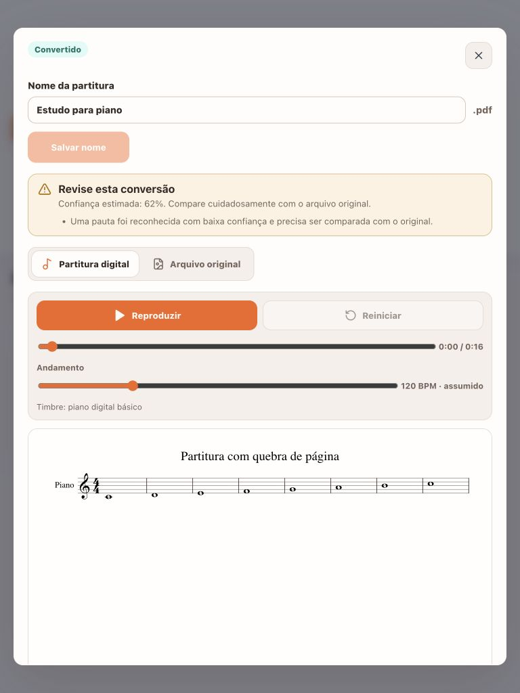
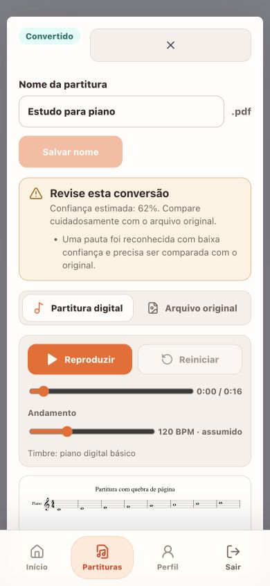
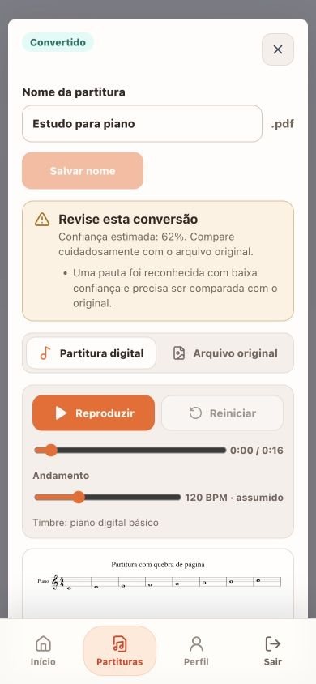

# Auditoria da experiência MIDI web

Data: 2026-07-27  
Escopo: Entrega 4 do `roadmap-midi.md`  
Objetivo do usuário: abrir uma partitura convertida, acompanhar sua reprodução visual e exportar MusicXML ou MIDI para outros aplicativos.

## Resultado

A experiência web está funcional no Chrome e responsiva em desktop, tablet e viewport equivalente a iPhone. A homologação total da Entrega 4 ainda depende de executar o fluxo completo, incluindo áudio, manualmente no Safari e Firefox e da aprovação do comportamento pelo responsável do produto.

## Fluxo auditado

1. **Início — saudável.** Upload e navegação principal permanecem disponíveis.

   

2. **Lista de partituras — saudável.** O usuário encontra a partitura convertida e abre os detalhes.

   

3. **Player pronto — saudável.** A partitura digital, os controles, o aviso de baixa confiança e os dois downloads são apresentados juntos.

   

4. **Reprodução — saudável.** A nota ativa recebe destaque visual durante o áudio.

   

5. **Tablet — corrigido.** Os controles antes ultrapassavam o modal; agora são empilhados sem corte.

   Antes:

   

   Depois:

   

6. **iPhone — corrigido.** O estilo móvel atingia indevidamente o botão de fechar; o seletor foi limitado às ações de cards.

   Antes:

   

   Depois:

   

## Validações musicais

- Sete testes com MusicXML real verificam pitches, ataques, durações, andamento, acordes, ligaduras, acidentes, múltiplas partes e sequência entre páginas.
- A ligadura F# produz uma única nota sustentada no MIDI, embora tenha duas cabeças de nota na representação visual.
- Piano e flauta permanecem em trilhas e canais distintos.
- Os quatro MIDIs de referência já haviam sido importados com sucesso no MuseScore 4.6.5.
- A diferença observada de 4 a 6 ms no `note-off` do Verovio está dentro da tolerância de 10 ms adotada pelos testes.

## Compatibilidade e desempenho

| Cenário | Resultado |
| --- | --- |
| Chrome 150 | Fluxo completo até SVG, sem erro ou warning no console. |
| Firefox 152.0.5 | Aplicação abriu sem crash; player e áudio ainda exigem teste manual completo. |
| Safari 26.5 | Compatibilidade estática verificada; player e áudio ainda exigem teste manual completo. |
| Fixture real de múltiplas páginas | 658 ms até exibir o SVG; heap JS aproximado de 35,4 MiB. |
| 100 compassos | 858,9 ms para carregar + 421,8 ms para MIDI; RSS aproximada de 100,5 MiB. |
| 300 compassos / 1.200 notas | 2,219 s para carregar + 992,7 ms para MIDI; RSS aproximada de 127,8 MiB. |

O bundle de produção mede cerca de 8,28 MB; o Verovio representa 7,85 MB minificados e 2,34 MB gzip. O carregamento permanece lazy. Para partituras muito longas, há risco de bloqueio da thread principal por cerca de 3,2 s e o scheduler atual percorre todos os eventos a cada 25 ms. Web Worker e cursor ordenado/busca binária ficam registrados como otimizações posteriores; não houve falha no conjunto de homologação.

## Acessibilidade e limites de evidência

- Botões e sliders têm nomes acessíveis; o modal recebe foco no botão Fechar.
- `Escape` fecha o modal e devolve o foco ao botão Ver detalhes.
- A inspeção cobriu estrutura semântica e operação por teclado, mas não substitui uma rodada manual com leitor de tela.
- Screenshots registram estados visuais; não são evidência suficiente de qualidade sonora. A validação de áudio foi feita no fluxo Chrome e por testes controlados do `AudioContext`.

## Pendências para encerrar a Entrega 4

1. Executar manualmente renderização, play/pause, busca, andamento, destaque e download no Safari e Firefox.
2. Obter aprovação do comportamento web antes de iniciar a implementação iOS.
